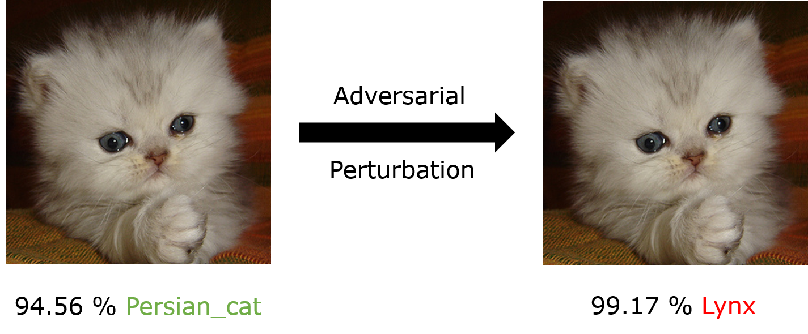

# C-W_InceptionV3_Imagenet
Simple implementation of the C&amp;W attack on a pre-trained Keras InceptionV3 on Imagenet

To generate the adversarial image simply run:

    Python adversarial_generation.py
    
To test the classification, Run:

    Python Inception_v3.py

# Adversarial Examples
Adversarial examples are inputs that has been slightly modified to be imperceptible by the human and cause a misclassification
Formalization often used: for a clean input x, an input x’ is an adversarial example if it is misclassified and d(x, x’) < eps.

For instance: For our example here is what we get using the C&W attack:

{:height="50px" width="10px"}

For more details about the C&W attack: 

  https://arxiv.org/abs/1608.04644

  https://www.youtube.com/watch?v=yIXNL88JBWQ
